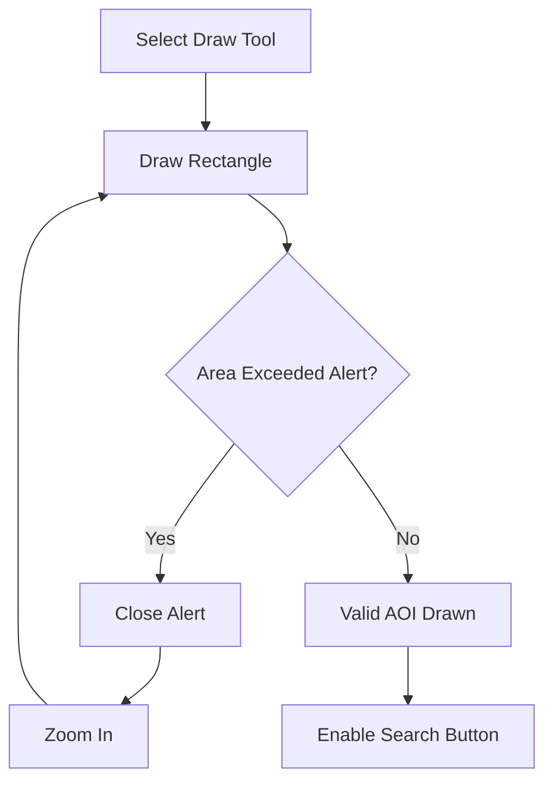
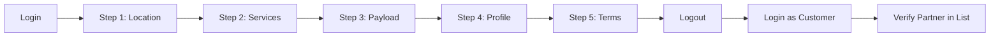
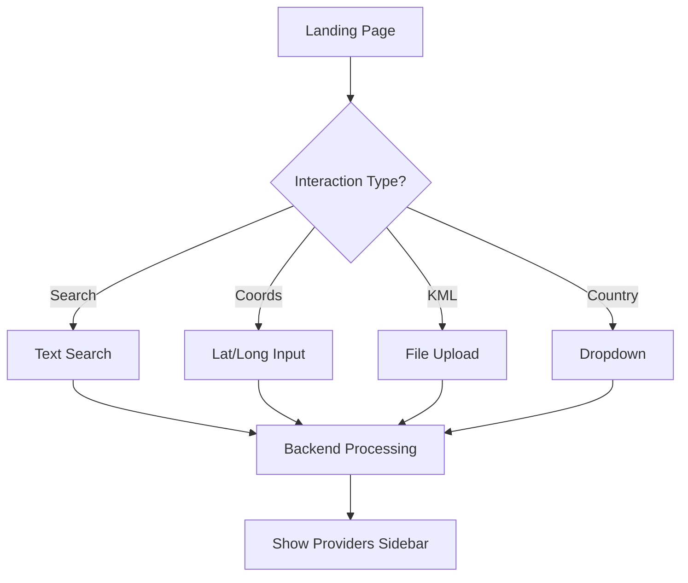

# 🛸 UAVSphere Automation Test Suite

  

This repository contains the end-to-end (E2E) automation test suite for the **UAVSphere** Drone Services Portal. It covers the complete lifecycle of a **Drone Service Provider** (Registration, Profile Management) and a **Drone Customer** (Search, Discovery, and Map Interactions).

---

## 📚 Table of Contents
1. [Test Architecture Overview](#test-architecture-overview)
2. [Test Suites Breakdown](#test-suites-breakdown)
   * [1. Authentication Setup](#1-authentication-setup-authsetupjs)
   * [2. Drone Customer Flow](#2-drone-customer-flow-dronecustomerspecjs)
   * [3. Drone Provider Flow](#3-drone-provider-flow-droneproviderspecjs)
3. [Key Logic & Selection Strategies](#key-logic--selection-strategies)
4. [Visual Flow Diagrams](#visual-flow-diagrams)
5. [Reporting](#reporting)

---

## 🏗️ Test Architecture Overview

The suite follows the **Page Object Model (POM)** to ensure scalability and maintainability.

- **Pages:**
  - `MapPage`: Handles complex map interactions (Drawing AOI, Coordinates, KML Upload, Search).
  - `ProviderDashboardPage`: Validates the post-login dashboard and step completion.
  - `ProviderProfilePage`: Manages the dynamic company profile form.
  - `ProviderRegistrationPage`, `ProviderLoginPage`, etc.
- **Helpers:** Centralized utilities (`utils/helpers.js`) for robust clicking, scrolling, and visual highlighting.
- **Reporters:** A custom email reporter (`reporters/email-reporter.cjs`) that sends detailed HTML reports with video/image artifacts.

---

## 🧪 Test Suites Breakdown

### 1. Authentication Setup (`auth.setup.js`)
This is a **Project Dependency** that runs before the Provider tests.
- **Action:** Navigates to the portal.
- **Logic:** Clicks "Are you a drone provider?" -> Fills credentials from `.env` -> Submits login.
- **Artifact:** Saves the authenticated browser state to `playwright/.auth/user.json`.
- **Purpose:** Ensures subsequent Provider tests start already logged in, bypassing the login screen.

---

### 2. Drone Customer Flow (`droneCustomer.spec.js`)

Tests the functionality available to unauthenticated users looking for drone services.

#### **TC-01: Search Location, Draw AOI, and Submit**
1.  **Setup:** Navigates to Landing Page -> Clicks "Are you a drone customer?".
2.  **Search:** Fills "Indore" -> Selects first Google Places suggestion.
3.  **AOI Drawing (Retry Logic):**
    *   Activates "Draw Rectangle" tool.
    *   Draws a rectangle on the map canvas.
    *   **Condition:** Checks for "Area Exceeded" alert.
    *   **Recovery:** If exceeded -> Closes alert -> Zooms In -> Redraws smaller rectangle.
    *   **Loop:** Retries up to 10 times until a valid AOI is drawn.
4.  **Search Execution:** Clicks "Search for drone pilots".
5.  **Wait Logic:** Waits up to **10 minutes** for the backend processing (monitors "Show X Providers" button).
6.  **Verification:** Clicks "Show Providers" -> Validates the Sidebar appears.

#### **TC-02: Open Coordinate Popup, Fill Details, Navigate**
1.  **Interaction:** Clicks "Coordinates Icon" in the sidebar.
2.  **Input:** Fills Latitude (`22.7196`) and Longitude (`75.8577`).
3.  **Action:** Clicks "Take Me".
4.  **Verification:** Validates the presence of the location marker on the map.

#### **TC-03: Navigate to Current Location (Mock)**
1.  **Mocking:** Sets browser geolocation to specific coordinates.
2.  **Interaction:** Clicks "Current Location Icon".
3.  **Verification:** Validates the presence of the "Blue Dot" current location marker.

#### **TC-04: Capture Coordinates**
1.  **Interaction:** Clicks "Capture Coordinates Icon".
2.  **Action:** Drags the map (simulating user movement).
3.  **Verification:** Validates a popup appears displaying "Latitude" and "Longitude".

#### **TC-05: Upload KML File**
1.  **Interaction:** Clicks "Upload KML Icon".
2.  **Input:** Sets files to `utils/test-data/india_Village_level_5.kml`.
3.  **Logic:** Waits for the map to zoom to the KML boundaries.
4.  **Search:** Clicks "Search for drone pilots" -> Waits for results.

#### **TC-06: Select Country**
1.  **Interaction:** Clicks "Country Dropdown Icon".
2.  **Input:** Selects "India" from the list.
3.  **Logic:** Waits for the map to zoom to the country level.
4.  **Search:** Clicks "Search for drone pilots" -> Waits for results.

---

### 3. Drone Provider Flow (`droneProvider.spec.js`)

A comprehensive "Happy Path" test that validates the 5-step registration/update workflow and verifies visibility on the customer front-end.

#### **Phase 1: Registration Update**
1.  **Dashboard Check:** Checks if the dashboard shows "Incomplete Registration" (Fresh) or "Completed" (Update mode).
2.  **Step 1 (Location):**
    *   Searches for "Vijay nagar".
    *   Draws AOI (with retry logic for size limits).
    *   Clicks "Go to Step-2".
3.  **Step 2 (Services):**
    *   Checks "Imagery-RGB" and "LiDAR".
    *   Checks "Drone imagery collection" and "Thermal data collection".
4.  **Step 3 (Payload):**
    *   Fills the payload details text area with drone specs.
5.  **Step 4 (Company Profile):**
    *   Handles "Edit User Details" button if profile exists.
    *   Uploads Company Logo.
    *   **Dynamic Data:** Generates unique Company Name using `Date.now()` (e.g., `Indore Drones 171084...`).
    *   Fills Address, City (React Select dropdown), State, Zip.
    *   Clicks "Go to Step 5".
6.  **Step 5 (Terms):**
    *   Checks the Terms checkbox.
    *   Clicks "Finish Your Registration".

#### **Phase 2: Dashboard Validation**
1.  **Verification:** Asserts the Welcome Message is visible.
2.  **State Check:** Validates that all 5 step containers have the class "completed".
3.  **Logout:** Clicks the Logout button.

#### **Phase 3: Customer Verification (The "Round Trip")**
1.  **Switch Role:** Clicks "Are you a drone customer?".
2.  **Search:** Selects "India" via the Country Dropdown.
3.  **Wait:** Waits for "Show Providers" button (up to 10 mins).
4.  **Partner Verification:**
    *   Opens the Provider Sidebar.
    *   **Asserts:** The newly created company name appears in the list.
    *   **Asserts:** The location text matches the data entered in Phase 1.

---

## 🧠 Key Logic & Selection Strategies

### 1. Resilient AOI Drawing
The map interaction is designed to handle strict backend constraints:


### 2. Long-Running Process Handling
Tests use extended timeouts (up to 10 minutes) for backend geospatial processing:
```javascript
// Example from MapPage
await this.showProvidersBtn.waitFor({ state: 'visible', timeout: 600000 }); // 10 mins
```

### 3. Dynamic Partner Verification
The suite stores the generated company name in a variable during the Provider flow and reuses it in the Customer flow to verify the exact record appears in the search results.

---

## 📊 Visual Flow Diagrams

### Provider Registration Flow


### Customer Search Flow


---

## 📧 Reporting

This project includes a **Custom Email Reporter**.

- **Triggers:**
  - Always sends a "Daily Summary" (Pass/Fail counts).
  - Sends "Detailed Report" if any tests fail or have warnings.
- **Attachments:**
  - Screenshots and Videos are attached automatically for failed tests.
  - Artifacts are embedded in the HTML email body (if size < 20MB).
- **Configuration:**
  - Requires `SMTP_HOST`, `SMTP_USER`, `SMTP_PASS`, and destination emails in `.env`.

---

## 🛠️ Setup & Execution

### Prerequisites
*   Node.js (v18+)
*   Playwright

### Installation
```bash
npm install
npx playwright install
```

### Configuration
Create a `.env` file in the root directory:
```env
TEST_USERNAME=your_provider_email
TEST_PASSWORD=your_password
SMTP_HOST=smtp.example.com
SMTP_USER=your_email
SMTP_PASS=your_smtp_password
FAILURE_ALERT_EMAILS=recipient@example.com
```

### Running Tests
```bash
# Run all tests (Headless)
npx playwright test

# Run specific suite (Headed)
npx playwright test tests/droneCustomer.spec.js --headed

# Run with specific project
npx playwright test --project=customer-chromium
```
